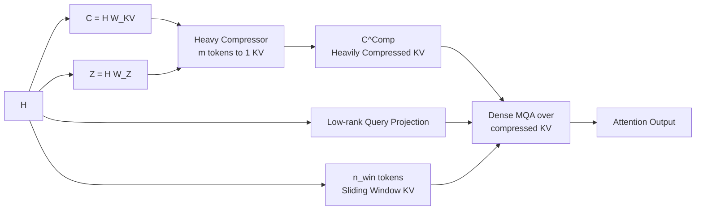

# DeepSeek-V4 技术报告深度解读

> **官方 DeepSeek-V4 技术报告《DeepSeek-V4: Towards Highly Efficient Million-Token Context Intelligence》**的详细解读。

---

# 0. 一句话总览：V4 的核心创新是什么？

DeepSeek-V4 不是简单把 V3 放大，而是围绕 **"百万 token 上下文下还能高效推理和做 agent"** 做了系统级重构。核心创新可以归纳为 6 类：

1. **混合注意力架构 Hybrid Attention**：把 **CSA / Compressed Sparse Attention** 和 **HCA / Heavily Compressed Attention** 交错放到不同层，用压缩 + 稀疏 + 滑窗解决长上下文注意力成本。
2. **mHC / Manifold-Constrained Hyper-Connections**：用流形约束的超连接替代普通残差连接，让残差信息流更宽、更稳定。
3. **Muon 优化器**：大部分参数从 AdamW 切换到 Muon，用 Newton-Schulz 正交化更新矩阵，提高收敛和稳定性。
4. **DeepSeekMoE 的小改动 + Hash routing**：继续使用 DeepSeekMoE，但调整路由打分函数、负载均衡策略，并把前几层 dense FFN 换成 Hash-routing MoE。
5. **FP4 QAT + FP8/BF16 混合 KV 存储**：专家权重和 CSA indexer 的 QK 路径做 FP4 量化感知训练，KV cache 用 FP8/BF16 混合存储。
6. **面向长上下文和 agent 的训练/推理基础设施**：包括细粒度 EP 通信计算重叠、TileLang kernel、确定性 kernel、异构 KV cache、on-disk KV prefix cache、OPD 后训练、DSML 工具调用格式、interleaved thinking 等。报告称 V4 保留 Transformer、DeepSeekMoE 和 MTP，但主要新增 mHC、CSA/HCA hybrid attention、Muon optimizer。

---

# 1. 模型结构总览

## 1.1 两个模型规格

| 项目 | DeepSeek-V4-Flash | DeepSeek-V4-Pro |
|---|---:|---:|
| Transformer 层数 | 43 | 61 |
| hidden size `d` | 4096 | 7168 |
| 总参数 | 284B | 1.6T |
| 每 token 激活参数 | 13B | 49B |
| 上下文长度 | 1M tokens | 1M tokens |
| CSA 压缩率 `m` | 4 | 4 |
| CSA top-k | 512 | 1024 |
| HCA 压缩率 `m'` | 128 | 128 |
| sliding window `n_win` | 128 | 128 |
| query heads `n_h` | 64 | 128 |
| MoE routed experts | 256 | 384 |
| 每 token 激活 routed experts | 6 | 6 |
| shared expert | 1 | 1 |
| mHC expansion `n_hc` | 4 | 4 |
| Sinkhorn iterations | 20 | 20 |

V4-Flash 的前两层使用纯 sliding window attention，之后 CSA/HCA 交错；V4-Pro 的前两层使用 HCA，之后 CSA/HCA 交错。Flash 每层 1 个 shared expert + 256 routed experts，Pro 每层 1 个 shared expert + 384 routed experts，每 token 激活 6 个 routed experts。

---

## 1.2 总体结构示意图

论文 Figure 2 给出的整体结构是：输入 token 经过 embedding 后进入多层 Transformer block；attention 层使用 CSA/HCA 混合；FFN 使用 DeepSeekMoE；普通 residual connection 被 mHC 加强；末端还有 MTP 模块和预测头。

下面是我按论文 Figure 2 重画的结构示意：

```mermaid
flowchart TD
    A[Input Tokens] --> B[Embedding]
    B --> C[Transformer Block x L]

    subgraph Block[One Transformer Block]
        X[X_l\nExpanded Residual Stream]
        X --> Apre[A_l X_l\nmHC Pre-Block Mixing]
        Apre --> Attn[CSA or HCA\nHybrid Attention]
        Attn --> Apost[C_l F_l(A_l X_l)\nmHC Post-Block Mixing]
        X --> Bres[B_l X_l\nmHC Residual Mixing]
        Apost --> Sum1[Add / Mix]
        Bres --> Sum1

        Sum1 --> Mpre[mHC Pre-Block Mixing]
        Mpre --> MoE[DeepSeekMoE FFN]
        MoE --> Mpost[mHC Post-Block Mixing]
        Sum1 --> Mres[mHC Residual Mixing]
        Mpost --> Sum2[Add / Mix]
        Mres --> Sum2
    end

    C --> D[Prediction Head]
    C --> E[MTP Modules]
    D --> F[LM Loss]
    E --> G[MTP Loss]
```

---

# 2. 创新一：Hybrid Attention = CSA + HCA

这是 V4 最核心的架构创新。普通 dense attention 在长上下文下的瓶颈很明显：

- **Prefill 阶段**：注意力复杂度约为 $O(n^2)$
- **Decode 阶段**：每生成一个 token，需要和已有上下文做注意力，约为 $O(n)$
- **KV cache 大小**随上下文长度线性增长：$O(nL)$
  - 其中 $n$ 是上下文长度，$L$ 是层数。

V4 的做法不是简单把 KV cache 存得更省，而是直接改变注意力访问方式：
**一部分层用 CSA 做"压缩 + 稀疏检索"，另一部分层用 HCA 做"极重压缩 + dense attention"。** CSA 每 $m$ 个 token 压成一个 KV entry，再从压缩后的 KV 中选 top-k；HCA 每 $m'$ 个 token 压成一个 KV entry，但不做 sparse selection，而是在极短的压缩序列上做 dense attention。报告明确说 CSA 先把每 $m$ 个 KV cache 压成一个 entry，再让每个 query 只 attend 到 $k$ 个压缩 KV；HCA 则用更大的 $m' \gg m$ 把 KV cache 极度压缩。

---

## 2.1 CSA：Compressed Sparse Attention

CSA 的核心是：

> **先压缩，再稀疏选择，最后用 MQA 做核心注意力。**

论文 Figure 3 展示了 CSA：token-level compressor 把 KV entry 压缩到原来的 $1/m$，Lightning Indexer 选 top-k compressed blocks，再加一个 sliding window 分支保留最近 token 的细粒度局部信息。

### CSA 原理图

```mermaid
flowchart LR
    H[H] --> KV[C^a, C^b\nKV streams]
    H --> Z[Z^a, Z^b\nCompression weights]
    KV --> Comp[Token-level Compressor\nm tokens to 1 KV]
    Z --> Comp
    Comp --> Ccomp[C^Comp\nCompressed KV]

    H --> IQ[q_t^I\nIndexer Query]
    Ccomp --> IK[K^IComp\nIndexer Keys]
    IQ --> Score[I_{t,s}\nLightning Indexer]
    IK --> Score
    Score --> TopK[Top-k Selector]
    Ccomp --> TopK

    TopK --> SparseKV[Selected Compressed KV]
    H --> SW[n_win tokens\nSliding Window KV]
    SparseKV --> Cat[Concatenate]
    SW --> Cat
    Cat --> MQA[Shared KV MQA]
    MQA --> Out[Attention Output]
```

---

## 2.2 CSA 的压缩公式

设输入 hidden states：

$$H \in \mathbb{R}^{n \times d}$$

其中 $n$ 是序列长度，$d$ 是 hidden size。CSA 先生成两组 KV entry 和对应压缩权重：

$$C^a = H W^a_{KV}, \quad C^b = H W^b_{KV}$$

$$Z^a = H W^a_Z, \quad Z^b = H W^b_Z$$

其中：

$$C^a, C^b, Z^a, Z^b \in \mathbb{R}^{n \times c}$$

$c$ 是 head dimension。报告写到 CSA 会生成两组 $C^a, C^b$ 和两组 $Z^a, Z^b$，然后用 compression weights 和 learnable positional bias 做压缩。

对第 $i$ 个 compressed entry，CSA 使用当前 block 的 $C^a$ 和前一个 block 的 $C^b$ 做带重叠的压缩。压缩权重为：

$$\left[ S^a_{mi:m(i+1)-1}; S^b_{m(i-1):mi-1} \right] = \operatorname{Softmax}_{row} \left( \left[ Z^a_{mi:m(i+1)-1} + B^a; Z^b_{m(i-1):mi-1} + B^b \right] \right)$$

压缩后的 KV entry：

$$C^{Comp}_i = \sum_{j=mi}^{m(i+1)-1} S^a_j \odot C^a_j + \sum_{j=m(i-1)}^{mi-1} S^b_j \odot C^b_j$$

这里 $\odot$ 是 Hadamard product。虽然一个 compressed entry 由 $2m$ 个 KV entry 贡献，但因为相邻 compressed entry 使用的区间有重叠，所以整体序列长度实际压缩到原来的：

$$\frac{1}{m}$$

论文中 V4 的 $m=4$，所以 CSA 主干压缩到原始长度的 1/4。

---

## 2.3 Lightning Indexer：压缩后的稀疏选择

压缩后，CSA 不会让每个 query attend 所有 compressed KV，而是用 Lightning Indexer 为每个 query 选 top-k compressed KV entries。先生成 query 的低秩 indexer 表示：

$$c^Q_t = h_t W_{DQ}$$

$$q^I_t = \left[ q^I_{t,1}; q^I_{t,2}; \ldots; q^I_{t,n^I_h} \right] = c^Q_t W^{I}_{UQ}$$

然后生成每个 indexer head 的权重：

$$w^I_t = \left[ w^I_{t,1}; w^I_{t,2}; \ldots; w^I_{t,n^I_h} \right] = h_t W_w$$

对 query token $t$ 和压缩 block $s$，打分为：

$$I_{t,s} = \sum_{h=1}^{n^I_h} w^I_{t,h} \cdot \operatorname{ReLU} \left( q^I_{t,h} \cdot K^{IComp}_s \right)$$

然后取 top-k：

$$C^{SprsComp}_t = \left\{ C^{Comp}_s \mid I_{t,s} \in \operatorname{TopK}(I_{t,:}) \right\}$$

V4-Flash 的 top-k 是 512，V4-Pro 是 1024。也就是说，在 1M 上下文里，注意力核心路径不是看全部历史 token，而是看**经过压缩后的少量关键 block**。

---

## 2.4 CSA 的核心注意力：Shared Key-Value MQA

选出 sparse compressed KV 后，CSA 使用 MQA。论文里说每个 compressed KV entry 同时作为 key 和 value。先生成多头 query：

$$\left[ q_{t,1}; q_{t,2}; \ldots; q_{t,n_h} \right] = q_t = c^Q_t W_{UQ}$$

然后第 $i$ 个 query head 的输出：

$$o_{t,i} = \operatorname{CoreAttn} \left( \text{query} = q_{t,i}, \text{key} = C^{SprsComp}_t, \text{value} = C^{SprsComp}_t \right)$$

直观理解：CSA 的注意力不是访问原始 $n$ 个 token，而是访问：

$$k + n_{win}$$

个左右的信息源，其中 $k$ 是 top-k compressed KV，$n_{win}$ 是最近 sliding window token。论文还加入 grouped output projection，避免直接把所有 head output 投影回 hidden size 时计算过大。

---

# 3. 创新二：HCA / Heavily Compressed Attention

HCA 的逻辑比 CSA 更极端：

> **不用 sparse selection，而是把 KV 压得非常短，然后直接 dense attention。**

论文 Figure 4 展示了 HCA：它把 $m' \gg m$ 个 token 的 KV entry 压缩成一个，并保留 sliding window 分支增强局部依赖。

### HCA 原理图



---

## 3.1 HCA 公式

HCA 首先生成 KV 和压缩权重：

$$C = H W_{KV}$$

$$Z = H W_Z$$

每 $m'$ 个 KV entry 压成一个。压缩权重：

$$S_{m'i:m'(i+1)-1} = \operatorname{Softmax}_{row} \left( Z_{m'i:m'(i+1)-1} + B \right)$$

压缩后的 entry：

$$C^{Comp}_i = \sum_{j=m'i}^{m'(i+1)-1} S_j \odot C_j$$

HCA 把序列长度压缩到：

$$\frac{1}{m'}$$

V4 中 $m'=128$，所以 1M token 会被压到大约 8192 个 compressed entries；在这个尺度上做 dense attention 就便宜很多。论文明确说 HCA 采用更大的压缩率 $m' \gg m$，不做 overlapped compression，也不做 sparse attention。

HCA 之后也使用低秩 query projection 和 shared KV MQA：

$$c^Q_t = h_t W_{DQ}$$

$$\left[ q_{t,1}; q_{t,2}; \ldots; q_{t,n_h} \right] = c^Q_t W_{UQ}$$

$$o_{t,i} = \operatorname{CoreAttn} \left( \text{query} = q_{t,i}, \text{key} = C^{Comp}, \text{value} = C^{Comp} \right)$$

---

# 4. CSA 和 HCA 为什么要混合？

两者的角色不同：

| 机制 | 压缩率 | 是否稀疏选择 | 擅长 |
|---|---:|---|---|
| CSA | $m=4$ | 是，top-k | 更细粒度地找关键远程信息 |
| HCA | $m'=128$ | 否 | 低成本保留全局粗粒度上下文 |
| Sliding Window | 不压缩 | 看最近 $n_{win}=128$ tokens | 局部连续依赖、语法、短程信息 |

如果只用 CSA，虽然细，但 indexer 和 top-k 仍有成本；如果只用 HCA，虽然便宜，但信息太粗。V4 采用交错层：一些层做细粒度稀疏召回，另一些层做全局粗压缩感知，使模型既能看长上下文，又不会让每层都承担昂贵的长上下文注意力。报告称 hybrid CSA/HCA 与低精度计算、存储结合后，显著降低注意力 FLOPs 和 KV cache；与 BF16 GQA8、head dim 128 的常见配置相比，1M context 下 V4 的 KV cache 可降到约 **2%**。

---

# 5. 注意力中的其他关键细节

## 5.1 Query/KV RMSNorm

CSA 和 HCA 都会在 core attention 前对每个 query head 和 compressed KV head 做 RMSNorm，以避免 attention logits 爆炸，提高训练稳定性。

## 5.2 Partial RoPE：只在最后 64 维使用 RoPE

V4 对 CSA/HCA 的 query、KV entry 和 core attention output 的最后 64 维使用 RoPE。因为 compressed KV 同时作为 key 和 value，如果直接加权求和，输出会带绝对位置信息；论文用对输出再施加位置 $-i$ 的 RoPE 来抵消，使输出更接近相对位置信息。

## 5.3 Sliding Window 分支

由于 CSA/HCA 的压缩 KV block 只允许 query attend 到前面的 compressed block，query 无法访问自己所在压缩 block 内的其他 token；同时最近 token 对语言建模很重要。因此 V4 给 CSA/HCA 都额外加了 sliding window attention 分支，每个 query 还能访问最近 $n_{win}$ 个未压缩 KV。V4 中 $n_{win}=128$。

## 5.4 Attention Sink

V4 在注意力 softmax 分母中加入 learnable sink logit：

$$s_{h,i,j} = \frac{\exp(z_{h,i,j})}{\sum_k \exp(z_{h,i,k}) + \exp(z'_h)}$$

这使得每个 query head 的总注意力权重不必严格等于 1，甚至可以接近 0。直观上，如果当前 head 觉得没有什么值得 attend，可以把注意力"流"到 sink，而不是被迫分配给某些 token。

---

# 6. 创新三：mHC / Manifold-Constrained Hyper-Connections

mHC 是 V4 的另一个核心结构创新。普通 Transformer residual stream 是一个 $d$-维向量流；Hyper-Connections 把 residual stream 扩展成 $n_{hc}$ 条并行流：

$$X_l = [x_{l,1}; \ldots; x_{l,n_{hc}}]^T \in \mathbb{R}^{n_{hc} \times d}$$

标准 HC 的更新为：

$$X_{l+1} = B_l X_l + C_l F_l(A_l X_l)$$

其中：

- $A_l \in \mathbb{R}^{1 \times n_{hc}}$：把多条 residual stream 混合成实际 layer input；
- $B_l \in \mathbb{R}^{n_{hc} \times n_{hc}}$：residual stream 之间的传递矩阵；
- $C_l \in \mathbb{R}^{n_{hc} \times 1}$：把 layer output 分配回多条 residual stream；
- $F_l$：当前层，比如 attention 或 MoE。

报告指出 HC 能在较小额外计算下提供新的 scaling 轴，但多层堆叠时容易数值不稳定。

---

## 6.1 mHC 的关键：把 $B_l$ 约束到 Birkhoff polytope

mHC 的核心是约束 residual mapping matrix：

$$B_l \in \mathcal{M}$$

其中 $\mathcal{M}$ 是双随机矩阵集合，也就是 Birkhoff polytope：

$$\mathcal{M} = \left\{ M \in \mathbb{R}^{n \times n} \mid M \mathbf{1}_n = \mathbf{1}_n, \; \mathbf{1}_n^T M = \mathbf{1}_n^T, \; M \ge 0 \right\}$$

这意味着：

- 每一行和为 1；
- 每一列和为 1；
- 所有元素非负。

直观理解：$B_l$ 是**双随机矩阵**，它让信息在多条 residual stream 之间以"守恒"的方式传递——每层的信息既不消失也不凭空增加，只是重新分配。约束到 Birkhoff polytope 后，$B_l$ 的谱半径严格限制在 $[0, 1]$ 内，梯度流动更稳定。

---

## 6.2 mHC 的训练稳定性分析

报告给出了一个关键定理：设损失为 $\mathcal{L}$，那么：

$$\frac{\partial \mathcal{L}}{\partial B_l} = \frac{\partial \mathcal{L}}{\partial X_{l+1}} X_l^T$$

由于 $B_l$ 被约束在 Birkhoff polytope 中，$X_l$ 的梯度传播满足：

$$\| \Delta X_l \| \le \| \Delta X_{l+1} \|$$

这说明信号在层间传播时不会指数级爆炸或消失。这是 mHC 相对于原始 HC 的核心改进。

---

# 7. 创新四：Muon 优化器

## 7.1 为什么不用 AdamW？

AdamW 对梯度做自适应学习率调度，但对于超大规模参数（如 V4 的 1.6T），深度网络的损失 landscape 在高维空间高度非凸。AdamW 的梯度压缩（weight decay）和自适应学习率在极端规模下可能不稳定。

## 7.2 Muon 的核心思想

Muon 使用 **Newton-Schulz 正交化**来更新矩阵：

$$M_k = aM_{k-1} + b(M_{k-1}M_{k-1}^T)M_{k-1} + c(M_{k-1}M_{k-1}^T)^2M_{k-1}$$

其中 $a, b, c$ 是可学习参数，$M_0$ 是初始矩阵。

直观理解：这个正交化过程使梯度更新矩阵 $M_k$ 近似满足 $M_k M_k^T = I$，即**正交更新**。正交矩阵不改变向量的模长，因此梯度更新的"步幅"更加一致，避免 AdamW 中自适应学习率导致的过度收缩或爆炸。

报告说 V4 的 embedding 参数、mHC 参数和其他大多数参数用 Muon 训练；FP8 训练时某些不适合 Muon 的组件（如 softmax normalizer）仍用 AdamW。

---

# 8. 创新五：FP4 QAT + FP8/BF16 混合精度

## 8.1 精度选择背景

V4 是首个在超大规模模型上全面采用 **FP4** 做量化感知训练（QAT）的模型。FP4 只有 16 个离散值（符号 + 3 位指数/尾数），精度极低，需要非常细致的量化策略。

## 8.2 V4 的混合精度布局

| 组件 | 精度 |
|------|------|
| MoE 专家权重 | FP4（MXFP4） |
| CSA Indexer 的 QK 路径 | FP4 |
| Attention 的 KV cache | FP8 / BF16 混合 |
| Lightning Indexer 内部注意力计算 | FP4 |
| 索引得分 | FP32 → BF16 |
| RoPE 旋转位置编码维度 | BF16 |
| 其他大多数参数 | FP8 |

## 8.3 MXFP4 量化

V4 采用 **MXFP4**（Mixed-peak FP4）格式，不同权重张量的指数偏移量不同，而非共享指数：

$$Q^{\text{FP4}}_i = \text{clamp} \left( \frac{Q_i}{s_i}, -3, 3 \right)$$

其中 $s_i$ 是每个权重块的最大绝对值：

$$s_i = \max(|Q_i|)$$

这样即使权重分布不均匀，FP4 也能更好地捕捉动态范围。

---

# 9. 创新六：细粒度专家并行（MegaMoE）

## 9.1 背景：EP 的通信瓶颈

MoE 的核心问题是：每个 token 只激活少数 expert，但 EP（Expert Parallelism）需要在节点间通信路由结果。当 expert 分布在多个 GPU/NPU 上时，all-to-all 通信成为瓶颈。

## 9.2 MegaMoE 的设计

DeepSeek 提出细粒度 EP 方案 **MegaMoE**：将通信与计算整合为单一流水线，实现通信与计算的重叠执行。

具体来说，expert 被分成多个 **expert wave**：

$$W_1, W_2, \ldots, W_T$$

每个 wave 包含一部分 expert，通信和计算交替执行：

```
for wave in [W_1, W_2, ..., W_T]:
    Token routing → All-to-All dispatch      # 通信
    Active experts forward pass               # 计算
    All-to-All gather results                # 通信
    → overlap with next wave's dispatch      # 重叠
```

报告称该方案在 NVIDIA GPU 和华为昇腾 NPU 上实现 **1.50-1.73 倍加速**。

---

# 10. 基础设施：TileLang 与确定性 Kernel

## 10.1 TileLang

V4 自研 **TileLang** 作为高效算子开发框架，支持 tile-based 计算图的自动调度。TileLang 的核心思想：

- 将大张量切成小 tile，每个 tile 可独立计算
- tile 间依赖通过显式依赖图描述
- 编译器自动生成融合 kernel，减少内存访问

## 10.2 确定性 Kernel

V4 使用**确定性 Kernel**：相同的输入序列总是产生相同的输出结果。这对科学计算、代码执行等场景至关重要。

确定性通过以下方式实现：

- 消除浮点运算的非确定性（如 reduction 顺序）
- 使用确定性的 hash routing
- 记录并重放随机种子

---

# 11. 推理优化：异构 KV Cache 与 On-Disk Prefix Cache

## 11.1 异构 KV Cache

V4 的 KV cache 分成两类：

| 类型 | 内容 | 精度 | 存储位置 |
|------|------|------|----------|
| Classical KV cache | sliding window KV（最近 128 token） | FP8/BF16 | GPU HBM |
| State cache | CSA/HCA 压缩后的 KV entries | FP8 | GPU HBM + CPU DRAM |

## 11.2 On-Disk KV Prefix Cache

对于**多轮对话**场景，前缀（system prompt、之前轮次的对话）的 KV cache 可以存储到 SSD，在新请求到来时直接从磁盘加载，避免重复 prefill。

---

# 12. 预训练细节

## 12.1 训练数据

- **语料总规模**：超过 32 万亿 tokens
- **类别**：数学内容、代码、网页文本、长文档等多种高质量类别
- **样本级注意力掩码**：对不同类型内容使用不同的注意力掩码策略

## 12.2 上下文扩展

- 预训练上下文从 32K 最终扩展到 **1M**
- 使用"样本级注意力掩码"机制，防止短上下文语料污染长上下文建模能力

---

# 13. 后训练：OPD + GRM + 强化学习

## 13.1 OPD：One PLUS Distillation

V4 的后训练使用 **OPD** 框架，把多个专家模型的知识蒸馏到统一学生模型：

$$\mathcal{L}_{OPD}(\theta) = \sum_{i=1}^{N} w_i \cdot D_{KL} \left( \pi_\theta \parallel \pi_{E_i} \right)$$

关键设计：使用 **reverse KL**（$\pi_\theta \parallel \pi_{E_i}$），而非 forward KL。Reverse KL 在知识蒸馏中更稳定，避免学生模型过度平滑。

---

# 14. 评测结果

## 14.1 Base 模型对比

| Benchmark | V3.2-Base | V4-Flash-Base | V4-Pro-Base |
|---|---:|---:|---:|
| Activated Params | 37B | 13B | 49B |
| Total Params | 671B | 284B | 1.6T |
| MMLU | 87.8 | 88.7 | 90.1 |
| MMLU-Pro | 65.5 | 68.3 | 73.5 |
| Simple-QA verified | 28.3 | 30.1 | 55.2 |
| FACTS Parametric | 27.1 | 33.9 | 62.6 |
| HumanEval | 62.8 | 69.5 | 76.8 |
| LongBench-V2 | 40.2 | 44.7 | 51.5 |

## 14.2 效率提升

| 指标 | V4-Pro vs V3.2 | V4-Flash vs V3.2 |
|------|---|---|
| 1M context 推理 FLOPs | **27%** | **10%** |
| 1M context KV cache | **10%** | **7%** |

V4-Flash-Base 虽然激活参数比 V3.2-Base 小得多，但在很多 benchmark 上超过 V3.2-Base；V4-Pro-Base 在知识、推理、代码、长上下文上整体成为 DeepSeek 系列更强的 foundation model。

---

# 15. 思考模式与推理强度控制

## 15.1 三档思考模式

| 模式 | 说明 |
|------|------|
| Non-think | 直接输出，不用 thinking |
| Think High | 常规深度思考 |
| Think Max | 最大推理努力，用专门系统提示 |

报告说不同模式在 RL 阶段使用不同 length penalty 和 context window，从而得到不同长度的 reasoning output；Think Max 会在 system prompt 开头注入专门指令。

## 15.2 Generative Reward Model

V4 对 hard-to-verify 任务不使用传统 scalar reward model，而是使用 rubric-guided RL data 和 Generative Reward Model / GRM。关键点是 actor network 本身也作为 GRM，用生成式方式评估 policy trajectories，从而把模型的 reasoning 能力融入 judging 过程。报告称这种方法只需要较少多样化人工标注。

## 15.3 OPD 目标函数

设有 $N$ 个专家模型：

$$\{ \pi_{E_1}, \pi_{E_2}, \ldots, \pi_{E_N} \}$$

统一学生模型为 $\pi_\theta$。OPD 目标：

$$\mathcal{L}_{OPD}(\theta) = \sum_{i=1}^{N} w_i \cdot D_{KL} \left( \pi_\theta \parallel \pi_{E_i} \right)$$

这里 $w_i$ 是专家权重。注意这里是 **reverse KL**，并且训练 trajectories 来自学生模型 $\pi_\theta$，所以是 on-policy。报告说 V4 使用超过 10 个 teacher models，覆盖多个领域，把 physically distinct expert weights 的知识通过 logits-level alignment 合并到统一参数空间，避免传统 weight merging 或 mixed RL 的性能退化。

报告还强调，V4 采用 **full-vocabulary logit distillation**，而不是 token-level KL estimate。后者虽然省资源，但梯度方差高、训练不稳定；full-vocab KL 更稳定、也更忠实地蒸馏 teacher knowledge。

---

# 16. Agent 相关优化：DSML、Interleaved Thinking、Quick Instruction

## 16.1 DSML 工具调用格式

V4 引入 `|DSML|` special token，并使用 XML-based tool-call schema。报告认为 XML 格式能缓解 escaping failures，减少工具调用错误。格式大致是：

```xml
<|DSML|tool_calls>
  <|DSML|invoke name="$TOOL_NAME">
    <|DSML|parameter name="$PARAMETER_NAME" string="true|false">
      $PARAMETER_VALUE
    </|DSML|parameter>
  </|DSML|invoke>
</|DSML|tool_calls>
```

其中 string 参数原样传递并标记 `string="true"`；数字、布尔、数组、对象等用 JSON 格式并标记 `string="false"`。

## 16.2 Interleaved Thinking

V3.2 在工具调用结果之间保留 reasoning traces，但遇到新的 user message 会丢弃。V4 借助 1M 上下文进一步改进：

- **工具调用场景**：完整保留所有 reasoning content，跨 user turns 也保留；
- **普通对话场景**：仍然在新 user message 到来时丢弃旧 thinking，保持上下文简洁。

这对长程 agent 任务很重要，因为 agent 可能经历多轮用户补充、工具调用、终端输出、代码修改；保留 reasoning state 可以避免每轮重新构建上下文。

## 16.3 Quick Instruction

V4 在 chatbot 场景加入 Quick Instruction：把搜索判断、意图识别、标题生成、搜索 query 生成、authority/domain 分类等辅助任务编码成 special tokens，直接附加到输入序列里，让同一个大模型复用已计算的 KV cache 完成这些辅助任务，避免额外小模型重复 prefill，从而降低用户感知 TTFT。

---

# 17. 模型效果：基座模型相对 V3.2 的变化

报告 Table 1 给出 base model 对比。几个关键点：

| Benchmark | V3.2-Base | V4-Flash-Base | V4-Pro-Base |
|---|---:|---:|---:|
| Activated Params | 37B | 13B | 49B |
| Total Params | 671B | 284B | 1.6T |
| MMLU | 87.8 | 88.7 | 90.1 |
| MMLU-Pro | 65.5 | 68.3 | 73.5 |
| Simple-QA verified | 28.3 | 30.1 | 55.2 |
| FACTS Parametric | 27.1 | 33.9 | 62.6 |
| HumanEval | 62.8 | 69.5 | 76.8 |
| LongBench-V2 | 40.2 | 44.7 | 51.5 |

V4-Flash-Base 虽然激活参数和总参数都比 V3.2-Base 小得多，但在很多 benchmark 上超过 V3.2-Base；V4-Pro-Base 则在知识、推理、代码、长上下文上整体成为 DeepSeek 系列更强的 foundation model。

---

# 18. 论文图表索引：你应该重点看哪些图？

官方报告里的关键图可以这样读：

| 图 | 内容 | 你看它是为了理解什么 |
|---|---|---|
| Figure 1 | benchmark + FLOPs/KV cache 曲线 | V4 相比 V3.2 的长上下文效率提升 |
| Figure 2 | 总体模型结构 | CSA/HCA + DeepSeekMoE + mHC + MTP 如何组合 |
| Figure 3 | CSA 结构 | 压缩 KV、Lightning Indexer、top-k、sliding window |
| Figure 4 | HCA 结构 | 128× heavy compression + dense MQA |
| Figure 5 | EP 通信计算重叠 | expert wave pipeline 如何隐藏通信 |
| Figure 6 | KV cache layout | CSA/HCA/SWA 异构 KV cache 如何管理 |
| Figure 7 | thinking management | 工具调用场景下如何保留 reasoning traces |

报告 Figure 2 明确画出整体结构；Figure 3 说明 CSA 会把 KV entries 压缩到 $1/m$，再用 DSA 加速，并叠加 sliding window KV；Figure 4 说明 HCA 用 $m' \gg m$ 的重压缩并保留 sliding window；Figure 6 说明 V4 的 KV cache 被分成 classical KV cache 和 state cache。

---

# 19. 总结：DeepSeek-V4 的创新逻辑

如果把 V4 的设计哲学压缩成一句话：

> **DeepSeek-V4 用"压缩注意力 + 稀疏检索 + 稳定残差流 + 低精度训练/推理 + 长上下文工程"共同解决百万 token 下的成本问题。**

更具体地说：

1. **CSA** 负责"细粒度远程信息选择"：
   $$n \rightarrow \frac{n}{4} \rightarrow top\text{-}k$$

2. **HCA** 负责"低成本全局感知"：
   $$n \rightarrow \frac{n}{128}$$

3. **Sliding Window** 负责"最近 token 的精细局部建模"：
   $$n_{win}=128$$

4. **mHC** 让 residual stream 从单通道变成多通道，并用 Birkhoff polytope 约束保证稳定：
   $$B_l \in \left\{ M \ge 0 \mid M\mathbf{1}=\mathbf{1}, \mathbf{1}^T M=\mathbf{1}^T \right\}$$

5. **Muon** 用近似正交化更新矩阵，使大规模训练更稳定：

   $$M_k = aM_{k-1} + b(M_{k-1}M_{k-1}^T)M_{k-1} + c(M_{k-1}M_{k-1}^T)^2M_{k-1}$$

6. **FP4 QAT + FP8 KV** 把 memory traffic 和 indexer 成本压下来。

7. **OPD + agent-specific post-training** 把多个 specialist 的能力合并到统一模型，并围绕工具调用、长程 reasoning、上下文管理做优化。

整体看，V4 的最大贡献不是单个 benchmark 分数，而是把 **1M context** 从"理论上支持"推进到"工程上可持续使用"：在 1M token 下，V4-Pro 只用 V3.2 的 27% FLOPs 和 10% KV cache，V4-Flash 进一步降到 10% FLOPs 和 7% KV cache。
