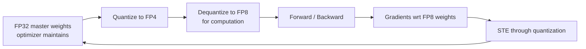
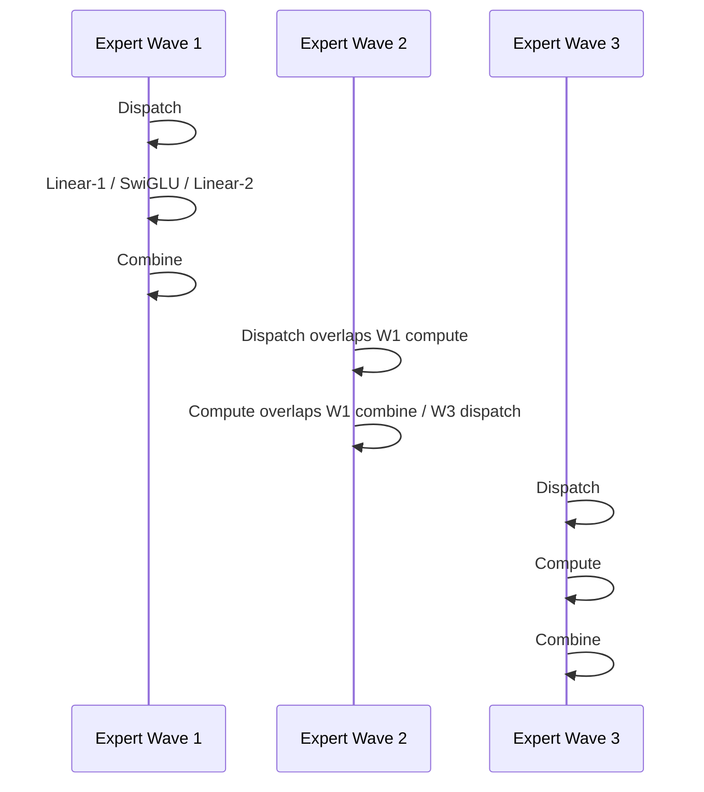

下面是我按**官方 DeepSeek-V4 技术报告《DeepSeek-V4: Towards Highly Efficient Million-Token Context Intelligence》**整理的详细解读。先说明一下：我这里看的版本是 Hugging Face `deepseek-ai/DeepSeek-V4-Pro` 仓库里的 PDF 技术报告；报告把 V4 称为 **preview version**，包含 **DeepSeek-V4-Pro** 和 **DeepSeek-V4-Flash** 两个 MoE 语言模型。报告摘要明确写到：V4-Pro 为 **1.6T 总参数、49B 激活参数**，V4-Flash 为 **284B 总参数、13B 激活参数**，二者都支持 **100 万 token 上下文**；在 1M token 场景下，V4-Pro 相比 DeepSeek-V3.2 只需要 **27% 单 token 推理 FLOPs** 和 **10% KV cache**。

---

# 0. 一句话总览：V4 的核心创新是什么？

DeepSeek-V4 不是简单把 V3 放大，而是围绕 **“百万 token 上下文下还能高效推理和做 agent”** 做了系统级重构。核心创新可以归纳为 6 类：

1. **混合注意力架构 Hybrid Attention**：把 **CSA / Compressed Sparse Attention** 和 **HCA / Heavily Compressed Attention** 交错放到不同层，用压缩 + 稀疏 + 滑窗解决长上下文注意力成本。
2. **mHC / Manifold-Constrained Hyper-Connections**：用流形约束的超连接替代普通残差连接，让残差信息流更宽、更稳定。
3. **Muon 优化器**：大部分参数从 AdamW 切换到 Muon，用 Newton-Schulz 正交化更新矩阵，提高收敛和稳定性。
4. **DeepSeekMoE 的小改动 + Hash routing**：继续使用 DeepSeekMoE，但调整路由打分函数、负载均衡策略，并把前几层 dense FFN 换成 Hash-routing MoE。
5. **FP4 QAT + FP8/BF16 混合 KV 存储**：专家权重和 CSA indexer 的 QK 路径做 FP4 量化感知训练，KV cache 用 FP8/BF16 混合存储。
6. **面向长上下文和 agent 的训练/推理基础设施**：包括细粒度 EP 通信计算重叠、TileLang kernel、确定性 kernel、异构 KV cache、on-disk KV prefix cache、OPD 后训练、DSML 工具调用格式、interleaved thinking 等。报告称 V4 保留 Transformer、DeepSeekMoE 和 MTP，但主要新增 mHC、CSA/HCA hybrid attention、Muon optimizer。

---

# 1. 模型结构总览

## 1.1 两个模型规格

| 项目 | DeepSeek-V4-Flash | DeepSeek-V4-Pro |
|---|---:|---:|
| Transformer 层数 | 43 | 61 |
| hidden size `d` | 4096 | 7168 |
| 总参数 | 284B | 1.6T |
| 每 token 激活参数 | 13B | 49B |
| 上下文长度 | 1M tokens | 1M tokens |
| CSA 压缩率 `m` | 4 | 4 |
| CSA top-k | 512 | 1024 |
| HCA 压缩率 `m'` | 128 | 128 |
| sliding window `n_win` | 128 | 128 |
| query heads `n_h` | 64 | 128 |
| MoE routed experts | 256 | 384 |
| 每 token 激活 routed experts | 6 | 6 |
| shared expert | 1 | 1 |
| mHC expansion `n_hc` | 4 | 4 |
| Sinkhorn iterations | 20 | 20 |

V4-Flash 的前两层使用纯 sliding window attention，之后 CSA/HCA 交错；V4-Pro 的前两层使用 HCA，之后 CSA/HCA 交错。Flash 每层 1 个 shared expert + 256 routed experts，Pro 每层 1 个 shared expert + 384 routed experts，每 token 激活 6 个 routed experts。

---

## 1.2 总体结构示意图

论文 Figure 2 给出的整体结构是：输入 token 经过 embedding 后进入多层 Transformer block；attention 层使用 CSA/HCA 混合；FFN 使用 DeepSeekMoE；普通 residual connection 被 mHC 加强；末端还有 MTP 模块和预测头。

下面是我按论文 Figure 2 重画的结构示意：

```mermaid
flowchart TD
    A[Input Tokens] --> B[Embedding]

    B --> C[Transformer Block × L]

    subgraph Block[One Transformer Block]
        X[Expanded Residual Stream<br/>X_l ∈ R^{n_hc × d}]
        X --> Apre[mHC Pre-Block Mixing<br/>A_l X_l]
        Apre --> Attn[Hybrid Attention<br/>CSA or HCA]
        Attn --> Apost[mHC Post-Block Mixing<br/>C_l F_l(A_l X_l)]
        X --> Bres[mHC Residual Mixing<br/>B_l X_l]
        Apost --> Sum1[Add / Mix]
        Bres --> Sum1

        Sum1 --> Mpre[mHC Pre-Block Mixing]
        Mpre --> MoE[DeepSeekMoE FFN]
        MoE --> Mpost[mHC Post-Block Mixing]
        Sum1 --> Mres[mHC Residual Mixing]
        Mpost --> Sum2[Add / Mix]
        Mres --> Sum2
    end

    C --> D[Prediction Head]
    C --> E[MTP Modules]
    D --> F[LM Loss]
    E --> G[MTP Loss]
```

---

# 2. 创新一：Hybrid Attention = CSA + HCA

这是 V4 最核心的架构创新。普通 dense attention 在长上下文下的瓶颈很明显：

- Prefill 阶段：注意力复杂度约为  
  \[
  O(n^2)
  \]
- Decode 阶段：每生成一个 token，需要和已有上下文做注意力，约为  
  \[
  O(n)
  \]
- KV cache 大小随上下文长度线性增长：  
  \[
  O(nL)
  \]
  其中 \(n\) 是上下文长度，\(L\) 是层数。

V4 的做法不是简单把 KV cache 存得更省，而是直接改变注意力访问方式：  
**一部分层用 CSA 做“压缩 + 稀疏检索”，另一部分层用 HCA 做“极重压缩 + dense attention”。** CSA 每 \(m\) 个 token 压成一个 KV entry，再从压缩后的 KV 中选 top-k；HCA 每 \(m'\) 个 token 压成一个 KV entry，但不做 sparse selection，而是在极短的压缩序列上做 dense attention。报告明确说 CSA 先把每 \(m\) 个 KV cache 压成一个 entry，再让每个 query 只 attend 到 \(k\) 个压缩 KV；HCA 则用更大的 \(m' \gg m\) 把 KV cache 极度压缩。

---

## 2.1 CSA：Compressed Sparse Attention

CSA 的核心是：

> **先压缩，再稀疏选择，最后用 MQA 做核心注意力。**

论文 Figure 3 展示了 CSA：token-level compressor 把 KV entry 压缩到原来的 \(1/m\)，Lightning Indexer 选 top-k compressed blocks，再加一个 sliding window 分支保留最近 token 的细粒度局部信息。

### CSA 原理图

```mermaid
flowchart LR
    H[Hidden states H ∈ R^{n×d}] --> KV[Generate two KV streams<br/>C^a, C^b]
    H --> Z[Generate compression weights<br/>Z^a, Z^b]
    KV --> Comp[Token-level Compressor<br/>m tokens → 1 compressed KV]
    Z --> Comp
    Comp --> Ccomp[Compressed KV<br/>C^Comp ∈ R^{n/m × c}]

    H --> IQ[Indexer Query<br/>low-rank q_t^I]
    Ccomp --> IK[Compressed Indexer Keys<br/>K^IComp]
    IQ --> Score[Lightning Indexer<br/>score I_{t,s}]
    IK --> Score
    Score --> TopK[Top-k Selector]
    Ccomp --> TopK

    TopK --> SparseKV[Selected Compressed KV]
    H --> SW[Sliding Window KV<br/>recent n_win tokens]
    SparseKV --> Cat[Concatenate]
    SW --> Cat
    Cat --> MQA[Shared KV MQA<br/>key=value=compressed KV]
    MQA --> Out[Attention Output]
```

---

## 2.2 CSA 的压缩公式

设输入 hidden states：

\[
H \in \mathbb{R}^{n \times d}
\]

其中 \(n\) 是序列长度，\(d\) 是 hidden size。CSA 先生成两组 KV entry 和对应压缩权重：

\[
C^a = H W^a_{KV}, \quad C^b = H W^b_{KV}
\]

\[
Z^a = H W^a_Z, \quad Z^b = H W^b_Z
\]

其中：

\[
C^a, C^b, Z^a, Z^b \in \mathbb{R}^{n \times c}
\]

\(c\) 是 head dimension。报告写到 CSA 会生成两组 \(C^a, C^b\) 和两组 \(Z^a, Z^b\)，然后用 compression weights 和 learnable positional bias 做压缩。

对第 \(i\) 个 compressed entry，CSA 使用当前 block 的 \(C^a\) 和前一个 block 的 \(C^b\) 做带重叠的压缩。压缩权重为：

\[
\left[
S^a_{mi:m(i+1)-1};
S^b_{m(i-1):mi-1}
\right]
=
\operatorname{Softmax}_{row}
\left(
\left[
Z^a_{mi:m(i+1)-1} + B^a;
Z^b_{m(i-1):mi-1} + B^b
\right]
\right)
\]

压缩后的 KV entry：

\[
C^{Comp}_i
=
\sum_{j=mi}^{m(i+1)-1}
S^a_j \odot C^a_j
+
\sum_{j=m(i-1)}^{mi-1}
S^b_j \odot C^b_j
\]

这里 \(\odot\) 是 Hadamard product。虽然一个 compressed entry 由 \(2m\) 个 KV entry 贡献，但因为相邻 compressed entry 使用的区间有重叠，所以整体序列长度实际压缩到原来的：

\[
\frac{1}{m}
\]

论文中 V4 的 \(m=4\)，所以 CSA 主干压缩到原始长度的 1/4。

---

## 2.3 Lightning Indexer：压缩后的稀疏选择

压缩后，CSA 不会让每个 query attend 所有 compressed KV，而是用 Lightning Indexer 为每个 query 选 top-k compressed KV entries。先生成 query 的低秩 indexer 表示：

\[
c^Q_t = h_t W_{DQ}
\]

\[
q^I_t =
\left[
q^I_{t,1};
q^I_{t,2};
\ldots;
q^I_{t,n^I_h}
\right]
=
c^Q_t W^{I}_{UQ}
\]

然后生成每个 indexer head 的权重：

\[
w^I_t =
\left[
w^I_{t,1};
w^I_{t,2};
\ldots;
w^I_{t,n^I_h}
\right]
=
h_t W_w
\]

对 query token \(t\) 和压缩 block \(s\)，打分为：

\[
I_{t,s}
=
\sum_{h=1}^{n^I_h}
w^I_{t,h}
\cdot
\operatorname{ReLU}
\left(
q^I_{t,h} \cdot K^{IComp}_s
\right)
\]

然后取 top-k：

\[
C^{SprsComp}_t
=
\left\{
C^{Comp}_s
\mid
I_{t,s} \in \operatorname{TopK}(I_{t,:})
\right\}
\]

V4-Flash 的 top-k 是 512，V4-Pro 是 1024。也就是说，在 1M 上下文里，注意力核心路径不是看全部历史 token，而是看**经过压缩后的少量关键 block**。

---

## 2.4 CSA 的核心注意力：Shared Key-Value MQA

选出 sparse compressed KV 后，CSA 使用 MQA。论文里说每个 compressed KV entry 同时作为 key 和 value。先生成多头 query：

\[
[q_{t,1}; q_{t,2}; \ldots; q_{t,n_h}]
=
q_t
=
c^Q_t W_{UQ}
\]

然后第 \(i\) 个 query head 的输出：

\[
o_{t,i}
=
\operatorname{CoreAttn}
\left(
query = q_{t,i},
key = C^{SprsComp}_t,
value = C^{SprsComp}_t
\right)
\]

直观理解：CSA 的注意力不是访问原始 \(n\) 个 token，而是访问：

\[
k + n_{win}
\]

个左右的信息源，其中 \(k\) 是 top-k compressed KV，\(n_{win}\) 是最近 sliding window token。论文还加入 grouped output projection，避免直接把所有 head output 投影回 hidden size 时计算过大。

---

# 3. 创新二：HCA / Heavily Compressed Attention

HCA 的逻辑比 CSA 更极端：

> **不用 sparse selection，而是把 KV 压得非常短，然后直接 dense attention。**

论文 Figure 4 展示了 HCA：它把 \(m' \gg m\) 个 token 的 KV entry 压缩成一个，并保留 sliding window 分支增强局部依赖。

### HCA 原理图

```mermaid
flowchart LR
    H[Hidden states H] --> KV[Generate KV C = H W_KV]
    H --> Z[Generate weights Z = H W_Z]
    KV --> Comp[Heavy Compressor<br/>m' tokens → 1 KV]
    Z --> Comp
    Comp --> Ccomp[Heavily Compressed KV<br/>C^Comp ∈ R^{n/m' × c}]

    H --> Q[Low-rank Query Projection]
    Ccomp --> MQA[Dense MQA over compressed KV]
    Q --> MQA
    H --> SW[Sliding Window KV<br/>recent n_win tokens]
    SW --> MQA
    MQA --> Out[Attention Output]
```

---

## 3.1 HCA 公式

HCA 首先生成 KV 和压缩权重：

\[
C = H W_{KV}
\]

\[
Z = H W_Z
\]

每 \(m'\) 个 KV entry 压成一个。压缩权重：

\[
S_{m'i:m'(i+1)-1}
=
\operatorname{Softmax}_{row}
\left(
Z_{m'i:m'(i+1)-1} + B
\right)
\]

压缩后的 entry：

\[
C^{Comp}_i
=
\sum_{j=m'i}^{m'(i+1)-1}
S_j \odot C_j
\]

HCA 把序列长度压缩到：

\[
\frac{1}{m'}
\]

V4 中 \(m'=128\)，所以 1M token 会被压到大约 8192 个 compressed entries；在这个尺度上做 dense attention 就便宜很多。论文明确说 HCA 采用更大的压缩率 \(m' \gg m\)，不做 overlapped compression，也不做 sparse attention。

HCA 之后也使用低秩 query projection 和 shared KV MQA：

\[
c^Q_t = h_t W_{DQ}
\]

\[
[q_{t,1}; q_{t,2}; \ldots; q_{t,n_h}]
=
c^Q_t W_{UQ}
\]

\[
o_{t,i}
=
\operatorname{CoreAttn}
\left(
query = q_{t,i},
key = C^{Comp},
value = C^{Comp}
\right)
\]


---

# 4. CSA 和 HCA 为什么要混合？

两者的角色不同：

| 机制 | 压缩率 | 是否稀疏选择 | 擅长 |
|---|---:|---|---|
| CSA | \(m=4\) | 是，top-k | 更细粒度地找关键远程信息 |
| HCA | \(m'=128\) | 否 | 低成本保留全局粗粒度上下文 |
| Sliding Window | 不压缩 | 看最近 \(n_{win}=128\) tokens | 局部连续依赖、语法、短程信息 |

如果只用 CSA，虽然细，但 indexer 和 top-k 仍有成本；如果只用 HCA，虽然便宜，但信息太粗。V4 采用交错层：一些层做细粒度稀疏召回，另一些层做全局粗压缩感知，使模型既能看长上下文，又不会让每层都承担昂贵的长上下文注意力。报告称 hybrid CSA/HCA 与低精度计算、存储结合后，显著降低注意力 FLOPs 和 KV cache；与 BF16 GQA8、head dim 128 的常见配置相比，1M context 下 V4 的 KV cache 可降到约 **2%**。

---

# 5. 注意力中的其他关键细节

## 5.1 Query/KV RMSNorm

CSA 和 HCA 都会在 core attention 前对每个 query head 和 compressed KV head 做 RMSNorm，以避免 attention logits 爆炸，提高训练稳定性。

## 5.2 Partial RoPE：只在最后 64 维使用 RoPE

V4 对 CSA/HCA 的 query、KV entry 和 core attention output 的最后 64 维使用 RoPE。因为 compressed KV 同时作为 key 和 value，如果直接加权求和，输出会带绝对位置信息；论文用对输出再施加位置 \(-i\) 的 RoPE 来抵消，使输出更接近相对位置信息。

## 5.3 Sliding Window 分支

由于 CSA/HCA 的压缩 KV block 只允许 query attend 到前面的 compressed block，query 无法访问自己所在压缩 block 内的其他 token；同时最近 token 对语言建模很重要。因此 V4 给 CSA/HCA 都额外加了 sliding window attention 分支，每个 query 还能访问最近 \(n_{win}\) 个未压缩 KV。V4 中 \(n_{win}=128\)。

## 5.4 Attention Sink

V4 在注意力 softmax 分母中加入 learnable sink logit：

\[
s_{h,i,j}
=
\frac{
\exp(z_{h,i,j})
}{
\sum_k \exp(z_{h,i,k}) + \exp(z'_h)
}
\]

这使得每个 query head 的总注意力权重不必严格等于 1，甚至可以接近 0。直观上，如果当前 head 觉得没有什么值得 attend，可以把注意力“流”到 sink，而不是被迫分配给某些 token。

---

# 6. 创新三：mHC / Manifold-Constrained Hyper-Connections

mHC 是 V4 的另一个核心结构创新。普通 Transformer residual stream 是一个 \(d\)-维向量流；Hyper-Connections 把 residual stream 扩展成 \(n_{hc}\) 条并行流：

\[
X_l =
[x_{l,1}; \ldots; x_{l,n_{hc}}]^T
\in
\mathbb{R}^{n_{hc} \times d}
\]

标准 HC 的更新为：

\[
X_{l+1}
=
B_l X_l
+
C_l F_l(A_l X_l)
\]

其中：

- \(A_l \in \mathbb{R}^{1 \times n_{hc}}\)：把多条 residual stream 混合成实际 layer input；
- \(B_l \in \mathbb{R}^{n_{hc} \times n_{hc}}\)：residual stream 之间的传递矩阵；
- \(C_l \in \mathbb{R}^{n_{hc} \times 1}\)：把 layer output 分配回多条 residual stream；
- \(F_l\)：当前层，比如 attention 或 MoE。  

报告指出 HC 能在较小额外计算下提供新的 scaling 轴，但多层堆叠时容易数值不稳定。

---

## 6.1 mHC 的关键：把 \(B_l\) 约束到 Birkhoff polytope

mHC 的核心是约束 residual mapping matrix：

\[
B_l \in \mathcal{M}
\]

其中 \(\mathcal{M}\) 是双随机矩阵集合，也就是 Birkhoff polytope：

\[
\mathcal{M}
=
\left\{
M \in \mathbb{R}^{n \times n}
\mid
M \mathbf{1}_n = \mathbf{1}_n,\;
\mathbf{1}_n^T M = \mathbf{1}_n^T,\;
M \ge 0
\right\}
\]

这意味着：

- 每一行和为 1；
- 每一列和为 1；
- 所有元素非负。

论文强调这个约束保证 \(\|B_l\|_2 \le 1\)，所以 residual transformation 是 non-expansive；并且这个集合对矩阵乘法封闭，因此深层堆叠时信号传播更稳定。

直观理解：

```mermaid
flowchart LR
    A[普通残差<br/>x_{l+1}=x_l+F_l(x_l)]
    B[HC<br/>多条 residual stream<br/>但 B_l 无约束易不稳定]
    C[mHC<br/>多条 stream + B_l 双随机约束<br/>稳定混合]

    A --> B --> C
```

---

## 6.2 mHC 的动态参数生成

mHC 不是固定 \(A_l,B_l,C_l\)，而是从当前输入动态生成。先把 residual state flatten 并 RMSNorm：

\[
\hat{X}_l
=
\operatorname{RMSNorm}(\operatorname{vec}(X_l))
\in
\mathbb{R}^{1 \times n_{hc}d}
\]

然后生成 unconstrained raw parameters：

\[
\tilde{A}_l
=
\alpha^{pre}_l
\cdot
(\hat{X}_l W^{pre}_l)
+
S^{pre}_l
\]

\[
\tilde{B}_l
=
\alpha^{res}_l
\cdot
\operatorname{Mat}(\hat{X}_l W^{res}_l)
+
S^{res}_l
\]

\[
\tilde{C}_l
=
\alpha^{post}_l
\cdot
(\hat{X}_l W^{post}_l)^T
+
S^{post}_l
\]

其中 \(\alpha\) 是初始化较小的 learnable gating factor，\(S\) 是静态 bias。

---

## 6.3 mHC 的约束方式

对 input/output mapping：

\[
A_l = \sigma(\tilde{A}_l)
\]

\[
C_l = 2\sigma(\tilde{C}_l)
\]

这样保证非负和有界。对 \(B_l\)，先指数化保证正数：

\[
M^{(0)} = \exp(\tilde{B}_l)
\]

然后用 Sinkhorn-Knopp 交替行列归一化：

\[
M^{(t)}
=
T_r
\left(
T_c(M^{(t-1)})
\right)
\]

最终：

\[
B_l = M^{(t_{max})}
\]

V4 中 \(t_{max}=20\)。

---

# 7. 创新四：Muon Optimizer

V4 对大部分参数使用 Muon，而不是纯 AdamW。AdamW 仍用于 embedding、prediction head、mHC 的 static biases 和 gating factors，以及所有 RMSNorm 权重；其他大部分模块使用 Muon。报告称使用 Muon 是为了更快收敛和更好的训练稳定性。

---

## 7.1 Muon 更新公式

对每个逻辑独立权重矩阵：

\[
W \in \mathbb{R}^{n \times m}
\]

第 \(t\) 步梯度：

\[
G_t = \nabla_W \mathcal{L}_t(W_{t-1})
\]

动量：

\[
M_t = \mu M_{t-1} + G_t
\]

Nesterov + Hybrid Newton-Schulz：

\[
O'_t =
\operatorname{HybridNewtonSchulz}(\mu M_t + G_t)
\]

rescale update RMS：

\[
O_t
=
O'_t \cdot \sqrt{\max(n,m)} \cdot \gamma
\]

权重更新：

\[
W_t
=
W_{t-1}(1-\eta\lambda)
-
\eta O_t
\]

其中 \(\eta\) 是 learning rate，\(\mu\) 是 momentum，\(\lambda\) 是 weight decay，\(\gamma\) 是 update rescaling factor。

---

## 7.2 Hybrid Newton-Schulz 正交化

设矩阵：

\[
M = U \Sigma V^T
\]

Muon 希望把更新近似正交化为：

\[
UV^T
\]

通常先归一化：

\[
M_0 = \frac{M}{\|M\|_F}
\]

然后迭代：

\[
M_k
=
aM_{k-1}
+
b(M_{k-1}M_{k-1}^T)M_{k-1}
+
c(M_{k-1}M_{k-1}^T)^2M_{k-1}
\]

V4 的 Hybrid Newton-Schulz 做 10 次迭代：

- 前 8 次：  
  \[
  (a,b,c)=(3.4445,-4.7750,2.0315)
  \]
  用来快速把奇异值推近 1；
- 后 2 次：  
  \[
  (a,b,c)=(2,-1.5,0.5)
  \]
  用来稳定奇异值到 1。

报告还说，因为 V4 的 attention 结构可以直接对 query 和 KV 做 RMSNorm，能避免 attention logits 爆炸，所以没有使用 QK-Clip。

---

# 8. 创新五：DeepSeekMoE 的调整

V4 继续使用 DeepSeekMoE：FFN 部分采用 fine-grained routed experts + shared experts。不同于 V3 的地方主要有：

1. 路由 affinity score 的激活函数从  
   \[
   \operatorname{Sigmoid}(\cdot)
   \]
   改成  
   \[
   \sqrt{\operatorname{Softplus}(\cdot)}
   \]
2. 继续使用 auxiliary-loss-free load balancing，但加了轻量的 sequence-wise balance loss，避免单个序列内部极端不均衡。
3. 去掉 routing target nodes 数量约束，并重新设计并行策略。
4. 前几个 Transformer block 里的 dense FFN 被换成使用 Hash routing 的 MoE 层。Hash routing 根据 token ID 的预定义 hash 函数决定目标 expert。

可以把 affinity 写成：

\[
a_{t,e}
=
\sqrt{
\operatorname{Softplus}
\left(
u_t^T e_e
\right)
}
=
\sqrt{
\log
\left(
1+\exp(u_t^T e_e)
\right)
}
\]

其中 \(u_t\) 是 token 表示，\(e_e\) 是 expert embedding 或路由向量。这个公式是对报告中 “Sqrt(Softplus)” 路由打分的数学化表达。

---

# 9. 创新六：FP4 QAT 与低精度 KV/Indexer

V4 的低精度优化非常关键，尤其是 1M 上下文下。

## 9.1 KV cache 混合存储

报告说 V4 的 KV entry 使用混合精度：

- RoPE dimensions：BF16；
- 其他维度：FP8。

这比纯 BF16 KV storage 约减少一半 KV cache。CSA 的 Lightning Indexer 中 attention computation 使用 FP4，以加速超长上下文下的 indexer 计算。

---

## 9.2 FP4 QAT 用在哪些地方？

V4 的 FP4 QAT 主要用于两个组件：

1. **MoE expert weights**：专家权重是 GPU memory 主要占用之一；
2. **CSA indexer 的 QK path**：QK activations 会被缓存、加载并参与乘法，因此用 FP4 可以显著降低长上下文 indexer 成本。

另外，V4 还把 index scores \(I_{:,:}\) 从 FP32 量化到 BF16；报告称这使 top-k selector 获得 **2× speedup**，同时保持 **99.7% KV entry recall**。

---

## 9.3 FP4 → FP8 的训练路径

MoE expert weights 的训练逻辑是：



报告中特别强调：FP4 到 FP8 的 dequantization 在他们当前设置下是 lossless，因为 FP8 E4M3 比 FP4 E2M1 多 2 个 exponent bits，有更大动态范围，可以吸收 FP4 sub-block 的 scale 信息。推理和 RL rollout 阶段则直接使用真实 FP4 quantized weights，而不是模拟量化，这样行为和线上部署一致，并减少 memory loading。

---

# 10. 长上下文效率：为什么 KV cache 能小这么多？

V4 的 KV cache 优化来自多个因素叠加：

1. CSA 把序列长度压到 \(1/m = 1/4\)；
2. HCA 把序列长度压到 \(1/m' = 1/128\)；
3. 大部分层不再保存标准 dense attention 的 full KV；
4. RoPE 维度用 BF16，其他 KV 维度用 FP8；
5. CSA indexer QK path 用 FP4；
6. sliding window 只保留最近 \(n_{win}=128\) 个未压缩 KV；
7. 推理框架为 CSA/HCA/SWA 设计异构 KV cache layout。

报告说，在 1M context 下，V4-Pro 相比 V3.2 的单 token FLOPs 是 27%，KV cache 是 10%；V4-Flash 是 10% FLOPs、7% KV cache；相对于常见 BF16 GQA8 baseline，V4 的 KV cache 大约只有 2%。

---

# 11. KV cache layout 与 on-disk prefix cache

混合注意力带来一个工程问题：不同层的 KV entry 类型不同，大小不同，更新规则不同。CSA 有 main compressed KV 和 indexer KV，HCA 有 heavily compressed KV，SWA 有最近窗口 KV，还要保存“尚未满一个压缩 block 的尾部 token state”。因此传统 PagedAttention 假设会被打破。报告 Figure 6 给出 V4 的 KV cache layout：分成 classical KV cache 和 state cache；state cache 保存 SWA KV 和未压缩尾部状态；classical KV cache 存 CSA/HCA 压缩 KV。

论文中的 block 设计是：每个 cache block 覆盖

\[
\operatorname{lcm}(m,m')
\]

个原始 token。于是每个 block 产生：

\[
k_1 =
\frac{\operatorname{lcm}(m,m')}{m}
\]

个 CSA compressed tokens，以及：

\[
k_2 =
\frac{\operatorname{lcm}(m,m')}{m'}
\]

个 HCA compressed tokens。

对 shared-prefix 请求，V4 使用 on-disk KV cache storage：

- CSA/HCA：直接把 compressed KV 存到磁盘，命中 prefix 时读取复用；
- SWA：因为未压缩、层层都有，体积约是 CSA/HCA compressed KV 的 8 倍，所以提供三种策略：
  1. Full SWA Caching；
  2. Periodic Checkpointing；
  3. Zero SWA Caching。

Zero SWA Caching 下，需要重算最后 \(n_{win}\cdot L\) 个 token 来恢复最后 \(n_{win}\) 个 SWA KV。

---

# 12. 训练基础设施优化

## 12.1 细粒度 Expert Parallelism：通信计算重叠

MoE 的瓶颈之一是 expert parallelism 里的 all-to-all 通信。V4 把 MoE 层分成：

- Dispatch；
- Linear-1；
- SwiGLU / activation；
- Linear-2；
- Combine。

报告的核心观察是：MoE 层内通信总时间小于计算总时间，所以如果把通信和计算放到统一 pipeline 中，通信可以被计算隐藏。V4 把 experts 分成多个 wave：一个 wave 的专家通信完成后立刻开始计算，不等所有专家通信完成；稳态下当前 wave 计算、下一 wave token transfer、已完成 expert 的 result sending 并行发生。

### EP wave pipeline 示意



报告称该 fine-grained EP scheme 在 NVIDIA GPU 和 Huawei Ascend NPU 上验证，相比强 non-fused baseline，一般推理 workload 提速 **1.50–1.73×**，在 RL rollout 和高速 agent serving 等 latency-sensitive 场景最高 **1.96×**。

---

## 12.2 通信-计算平衡公式

报告给了一个硬件设计层面的公式。若峰值计算吞吐是 \(C\)，互连带宽是 \(B\)，计算量是 \(V_{comp}\)，通信量是 \(V_{comm}\)，通信可以被完全隐藏的条件是：

\[
\frac{C}{B}
\le
\frac{V_{comp}}{V_{comm}}
\]

对 DeepSeek-V4-Pro，每个 token-expert pair 需要 \(6hd\) FLOPs，但通信只有 \(3h\) bytes，所以条件简化为：

\[
\frac{C}{B}
\le
2d
=
6144
\ \text{FLOPs/Byte}
\]

这意味着每 1 GB/s 互连带宽可以隐藏约 6.1 TFLOP/s 计算对应的通信；超过这个平衡点后，继续堆互连带宽收益递减。

---

## 12.3 TileLang 和确定性 kernel

V4 使用 TileLang 开发大量 fused kernels，避免复杂模型结构被拆成大量细粒度 Torch ATen operators。TileLang 的作用是兼顾开发效率和运行性能，方便快速验证 attention variants，并用于训练和推理部署。

此外，V4 还实现了 batch-invariant 和 deterministic kernels，目标是保证 pre-training、post-training、inference 的 bitwise 对齐。这样做有利于调试 loss spike、硬件问题和数值问题。报告提到：

- attention decoding 用 dual-kernel 保证 batch invariance；
- matrix multiplication 端到端替换为 DeepGEMM；
- sparse attention backward 避免 `atomicAdd` 非确定性；
- MoE backward 用 token order pre-processing 和 buffer isolation；
- mHC small matrix multiplication 用 deterministic reduction。

---

# 13. 长上下文训练策略

## 13.1 预训练数据

V4 在 V3 数据基础上增强了多样性和长上下文能力。报告提到：

- web 数据过滤自动生成和模板化内容，降低 model collapse 风险；
- 数学、代码仍是核心语料；
- mid-training 加入 agentic data 增强 coding/agent 能力；
- 多语数据更大，覆盖长尾文化知识；
- 特别强调 long-document data curation，包括 scientific papers、technical reports 等；
- 总预训练语料超过 32T tokens。

## 13.2 训练长度 curriculum

V4 不是一开始就上 1M context，而是逐步扩展：

\[
4K \rightarrow 16K \rightarrow 64K \rightarrow 1M
\]

V4-Flash 训练 32T tokens，V4-Pro 训练 33T tokens。Flash 最大 batch size 是 75.5M tokens，Pro 是 94.4M tokens。稀疏注意力不是一开始就启用：Flash 先用 dense attention warmup 1T tokens，然后在 64K sequence length 阶段引入 sparse attention，并先 warmup CSA 的 lightning indexer。

---

# 14. 训练稳定性：Anticipatory Routing + SwiGLU Clamping

训练 trillion-parameter MoE 会遇到 loss spike。报告说他们发现 spike 和 MoE outliers 强相关，而 routing 机制会加剧 outliers，于是用了两种稳定技术。

## 14.1 Anticipatory Routing

普通 routing 使用当前参数 \(\theta_t\) 计算 routing indices。V4 的 Anticipatory Routing 用历史参数计算 routing：

\[
r_t
=
R(x_t; \theta_{t-\Delta t})
\]

但 backbone feature computation 仍使用当前参数：

\[
h_t
=
F(x_t; \theta_t, r_t)
\]

也就是说，routing 网络和 backbone 的同步更新被解耦，打破 routing-induced vicious cycle。为了避免加载两份模型参数，V4 在 \(t-\Delta t\) 时提前 fetch 第 \(t\) 步数据，并预计算/缓存 routing indices。报告说如果全程启用会有约 20% wall-clock overhead，但他们做成 loss spike 触发式：检测到 spike 时短 rollback 并临时开启，稳定后恢复标准训练，因此总体额外开销很小。

## 14.2 SwiGLU Clamping

V4 对 SwiGLU 做数值裁剪：

- linear component 裁剪到：
  \[
  [-10, 10]
  \]
- gate component 上界裁剪到：
  \[
  10
  \]

报告称这能消除 outliers，显著稳定训练，同时不损害性能。

---

# 15. 后训练：从混合 RL 改为 OPD

V4 的后训练 pipeline 和 V3.2 类似，但一个关键变化是：

> **mixed RL stage 被 On-Policy Distillation / OPD 完全替代。**

整体思路是：

1. 先训练多个 domain specialists；
2. 每个 specialist 经过 SFT + GRPO；
3. 数学、代码、agent、instruction following 等领域分别训练专家；
4. 最后用 multi-teacher OPD 合并到一个 unified model。

---

## 15.1 三种 reasoning effort 模式

V4-Pro 和 V4-Flash 都支持三种推理模式：

| 模式 | 特点 | 格式 |
|---|---|---|
| Non-think | 快速、直觉式、适合简单任务 | `</think> summary` |
| Think High | 显式逻辑分析，更慢但更准 | `<think>...</think> summary` |
| Think Max | 最大推理努力，用专门系统提示 | special system prompt + `<think>...</think>` |

报告说不同模式在 RL 阶段使用不同 length penalty 和 context window，从而得到不同长度的 reasoning output；Think Max 会在 system prompt 开头注入专门指令。

---

## 15.2 Generative Reward Model

V4 对 hard-to-verify 任务不使用传统 scalar reward model，而是使用 rubric-guided RL data 和 Generative Reward Model / GRM。关键点是 actor network 本身也作为 GRM，用生成式方式评估 policy trajectories，从而把模型的 reasoning 能力融入 judging 过程。报告称这种方法只需要较少多样化人工标注。

---

## 15.3 OPD 目标函数

设有 \(N\) 个专家模型：

\[
\{
\pi_{E_1},
\pi_{E_2},
\ldots,
\pi_{E_N}
\}
\]

统一学生模型为 \(\pi_\theta\)。OPD 目标：

\[
\mathcal{L}_{OPD}(\theta)
=
\sum_{i=1}^{N}
w_i
\cdot
D_{KL}
\left(
\pi_\theta
\parallel
\pi_{E_i}
\right)
\]

这里 \(w_i\) 是专家权重。注意这里是 **reverse KL**，并且训练 trajectories 来自学生模型 \(\pi_\theta\)，所以是 on-policy。报告说 V4 使用超过 10 个 teacher models，覆盖多个领域，把 physically distinct expert weights 的知识通过 logits-level alignment 合并到统一参数空间，避免传统 weight merging 或 mixed RL 的性能退化。

报告还强调，V4 采用 **full-vocabulary logit distillation**，而不是 token-level KL estimate。后者虽然省资源，但梯度方差高、训练不稳定；full-vocab KL 更稳定、也更忠实地蒸馏 teacher knowledge。

---

# 16. Agent 相关优化：DSML、Interleaved Thinking、Quick Instruction

## 16.1 DSML 工具调用格式

V4 引入 `|DSML|` special token，并使用 XML-based tool-call schema。报告认为 XML 格式能缓解 escaping failures，减少工具调用错误。格式大致是：

```xml
<|DSML|tool_calls>
  <|DSML|invoke name="$TOOL_NAME">
    <|DSML|parameter name="$PARAMETER_NAME" string="true|false">
      $PARAMETER_VALUE
    </|DSML|parameter>
  </|DSML|invoke>
</|DSML|tool_calls>
```

其中 string 参数原样传递并标记 `string="true"`；数字、布尔、数组、对象等用 JSON 格式并标记 `string="false"`。

## 16.2 Interleaved Thinking

V3.2 在工具调用结果之间保留 reasoning traces，但遇到新的 user message 会丢弃。V4 借助 1M 上下文进一步改进：

- **工具调用场景**：完整保留所有 reasoning content，跨 user turns 也保留；
- **普通对话场景**：仍然在新 user message 到来时丢弃旧 thinking，保持上下文简洁。

这对长程 agent 任务很重要，因为 agent 可能经历多轮用户补充、工具调用、终端输出、代码修改；保留 reasoning state 可以避免每轮重新构建上下文。

## 16.3 Quick Instruction

V4 在 chatbot 场景加入 Quick Instruction：把搜索判断、意图识别、标题生成、搜索 query 生成、authority/domain 分类等辅助任务编码成 special tokens，直接附加到输入序列里，让同一个大模型复用已计算的 KV cache 完成这些辅助任务，避免额外小模型重复 prefill，从而降低用户感知 TTFT。

---

# 17. 模型效果：基座模型相对 V3.2 的变化

报告 Table 1 给出 base model 对比。几个关键点：

| Benchmark | V3.2-Base | V4-Flash-Base | V4-Pro-Base |
|---|---:|---:|---:|
| Activated Params | 37B | 13B | 49B |
| Total Params | 671B | 284B | 1.6T |
| MMLU | 87.8 | 88.7 | 90.1 |
| MMLU-Pro | 65.5 | 68.3 | 73.5 |
| Simple-QA verified | 28.3 | 30.1 | 55.2 |
| FACTS Parametric | 27.1 | 33.9 | 62.6 |
| HumanEval | 62.8 | 69.5 | 76.8 |
| LongBench-V2 | 40.2 | 44.7 | 51.5 |

V4-Flash-Base 虽然激活参数和总参数都比 V3.2-Base 小得多，但在很多 benchmark 上超过 V3.2-Base；V4-Pro-Base 则在知识、推理、代码、长上下文上整体成为 DeepSeek 系列更强的 foundation model。

---

# 18. 论文图表索引：你应该重点看哪些图？

官方报告里的关键图可以这样读：

| 图 | 内容 | 你看它是为了理解什么 |
|---|---|---|
| Figure 1 | benchmark + FLOPs/KV cache 曲线 | V4 相比 V3.2 的长上下文效率提升 |
| Figure 2 | 总体模型结构 | CSA/HCA + DeepSeekMoE + mHC + MTP 如何组合 |
| Figure 3 | CSA 结构 | 压缩 KV、Lightning Indexer、top-k、sliding window |
| Figure 4 | HCA 结构 | 128× heavy compression + dense MQA |
| Figure 5 | EP 通信计算重叠 | expert wave pipeline 如何隐藏通信 |
| Figure 6 | KV cache layout | CSA/HCA/SWA 异构 KV cache 如何管理 |
| Figure 7 | thinking management | 工具调用场景下如何保留 reasoning traces |

报告 Figure 2 明确画出整体结构；Figure 3 说明 CSA 会把 KV entries 压缩到 \(1/m\)，再用 DSA 加速，并叠加 sliding window KV；Figure 4 说明 HCA 用 \(m' \gg m\) 的重压缩并保留 sliding window；Figure 6 说明 V4 的 KV cache 被分成 classical KV cache 和 state cache。

---

# 19. 总结：DeepSeek-V4 的创新逻辑

如果把 V4 的设计哲学压缩成一句话：

> **DeepSeek-V4 用“压缩注意力 + 稀疏检索 + 稳定残差流 + 低精度训练/推理 + 长上下文工程”共同解决百万 token 下的成本问题。**

更具体地说：

1. **CSA** 负责“细粒度远程信息选择”：  
   \[
   n \rightarrow \frac{n}{4} \rightarrow top\text{-}k
   \]

2. **HCA** 负责“低成本全局感知”：  
   \[
   n \rightarrow \frac{n}{128}
   \]

3. **Sliding Window** 负责“最近 token 的精细局部建模”：  
   \[
   n_{win}=128
   \]

4. **mHC** 让 residual stream 从单通道变成多通道，并用 Birkhoff polytope 约束保证稳定：  
   \[
   B_l \in
   \left\{
   M \ge 0
   \mid
   M\mathbf{1}=\mathbf{1},
   \mathbf{1}^T M=\mathbf{1}^T
   \right\}
   \]

5. **Muon** 用近似正交化更新矩阵，使大规模训练更稳定：

   \[
   M_k
   =
   aM_{k-1}
   +
   b(M_{k-1}M_{k-1}^T)M_{k-1}
   +
   c(M_{k-1}M_{k-1}^T)^2M_{k-1}
   \]

6. **FP4 QAT + FP8 KV** 把 memory traffic 和 indexer 成本压下来。

7. **OPD + agent-specific post-training** 把多个 specialist 的能力合并到统一模型，并围绕工具调用、长程 reasoning、上下文管理做优化。

整体看，V4 的最大贡献不是单个 benchmark 分数，而是把 **1M context** 从“理论上支持”推进到“工程上可持续使用”：在 1M token 下，V4-Pro 只用 V3.2 的 27% FLOPs 和 10% KV cache，V4-Flash 进一步降到 10% FLOPs 和 7% KV cache。
